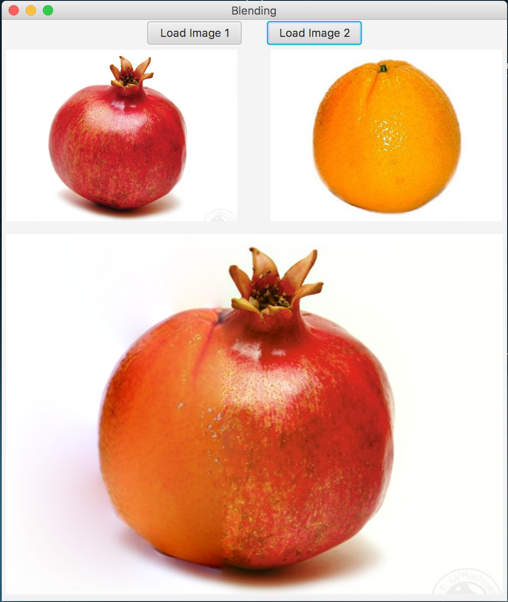
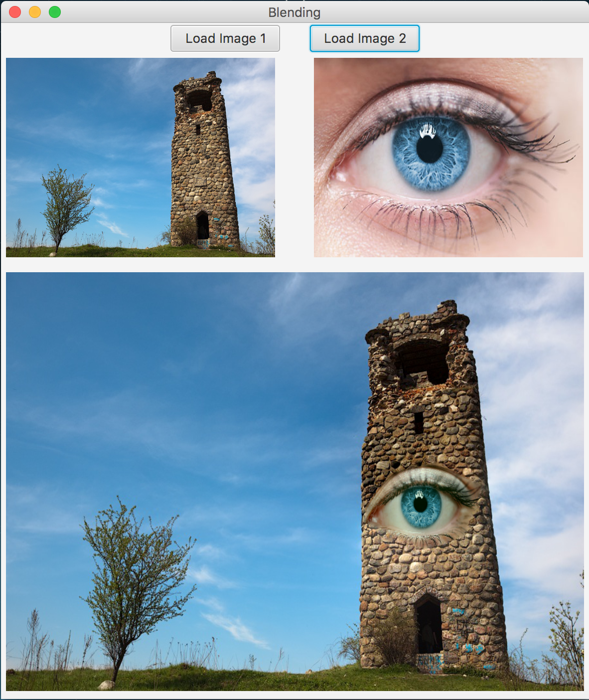

## Проект №2 "Программные средства решения математических задач" СГУ-КНиИТ.
## Цель:
	Используя библиотеку OpenCV выполнить Блендинг изображений
### Примеры работы программы:

### Сделанно: Студентом СГУ факультета КНиИТ
### Тиркия Гога
