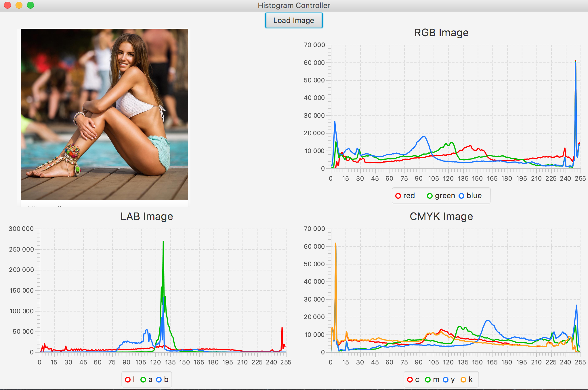

## Проект №2 "Программные средства решения математических задач" СГУ-КНиИТ.
## Цель:
	Построить гистограммы исходного изображения в 3-х цветовых пространствах(RGB, LAB, CMYK)
### Примеры работы программы:

### Сделанно: Студентом СГУ факультета КНиИТ
### Тиркия Гога