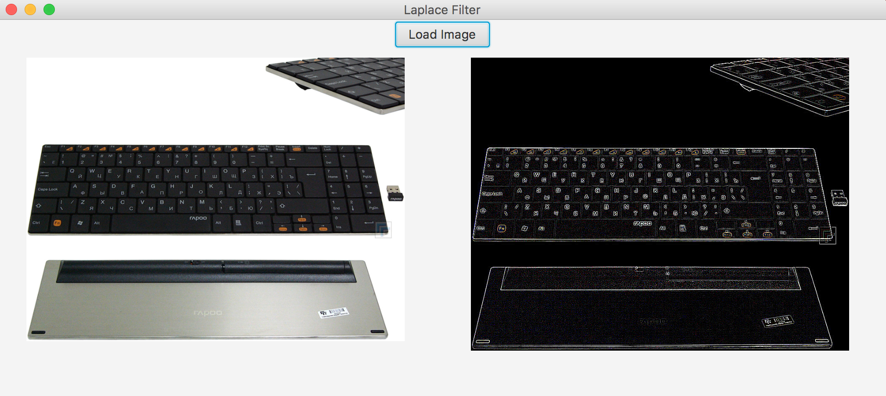

## Проект №3 "Программные средства решения математических задач" СГУ-КНиИТ.
## Цель:
	Применить к изображению фильтр Лапласа
### Примеры работы программы:

### Сделанно: Студентом СГУ факультета КНиИТ
### Тиркия Гога
